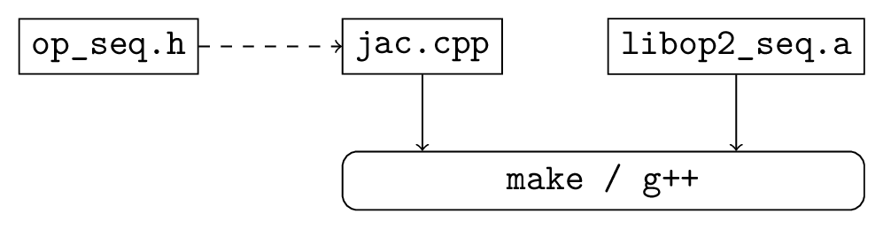
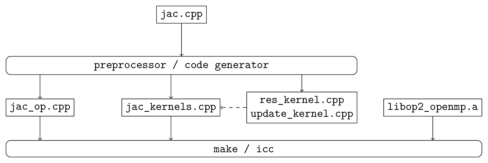

OP2 API
=======

Overview
--------

The key characteristic of unstructured-mesh applications is the explicit connectivity required to specify the mesh and access data (indirectly) on neighboring mesh elements during computation over mesh elements. As such OP2 allows to describe an unstructured mesh by a number of sets, where depending on the application, these sets might be of nodes, edges, faces, cells of a variety of types, far-field boundary nodes, wall boundary faces, etc. Associated with these are data (e.g. coordinate data at nodes) and mappings to other sets (i.e. explicit connectivity, e.g. edge mapping to the two nodes at each end of the edge). All of the numerically-intensive operations can then be described as a loop over all members of a set, carrying out some operations on data associated directly with the set or with another set through a mapping.

Key Concepts and Structure
--------------------------

OP2 makes the important restriction that the order in which the function is applied to the members of the set must not affect the final result to within the limits of finite precision floating-point arithmetic. This allows the parallel implementation to choose its own ordering to achieve maximum parallel efficiency. Two other restrictions are that the sets and maps are static (i.e. they do not change) and the operands in the set operations are not referenced through a double level of mapping indirection (i.e. through a mapping to another set which in turn uses another mapping to data in a third set).

OP2 currently enables users to write a single program at a high-level API declaring the unstructured-mesh problem. Then the OP2 code-generator can be used to automatically generate a number of different paralleizations, using different parallel programing models, targeting modern multi-core and many-core hardware. The most mature parallel code generated by OP2 are :

(1) Single-threaded on a CPU including code parallelized using SIMD
(2) Multi-threaded using OpenMP for multicore CPU systems
(3) Parallelized using CUDA for NVIDIA GPUs.

Further to these there are also in-development versions that can emit SYCL and AMD HIP for parallelization on a wider range of GPUs. All of the above can be combined with distributed-memory MPI parallelization to run of clusters of CPU or GPU nodes. The user can either use OP2’s parallel file I/O capabilities for HDF5 files with a specified structure, or perform their own parallel file I/O using custom MPI code.

.. note::
   This documentation describes the C++ API, but FORTRAN 90 is also supported with a very similar API.

A computational project can be viewed as involving three steps:

- Writing the program.
- Debugging the program, often using a small testcase.
- Running the program on increasingly large applications.

With OP2 we want to simplify the first two tasks, while providing as much performance as possible for the third.

To achieve the high performance for large applications, a code-generator is needed to generate the CUDA code for GPUs or OpenMP code for multicore x86 systems. However, to keep the initial development simple, a development single-threaded executable can be created without any special tools; the user’s main code is simply linked to a set of library routines, most of which do little more than error-checking to assist the debugging process by checking the correctness of the user’s program. Note that this single-threaded version will not execute efficiently. The code-generator is needed to generate efficient single-threaded (see 1. above) , SIMD and OpenMP code for CPU systems.

:numref:`seq-build` shows the build process for a single thread CPU executable. The user’s main program (in this case ``jac.cpp``) uses the OP2 header file ``op_seq.h`` and is linked to the appropriate OP2 libraries using ``g++``, perhaps controlled by a Makefile.

.. _seq-build:

   Build process for a single-threaded development executable.

:numref:`cuda-build` shows the build process for the corresponding CUDA executable. The code-generator parses the user’s main program and produces a modified main program and a CUDA file which includes a separate file for each of the kernel functions. These are then compiled and linked to the OP libraries using ``g++`` and the NVIDIA CUDA compiler ``nvcc``, again perhaps controlled by a Makefile.

.. _cuda-build:

   Build process for a CUDA accelerated executable.

:numref:`openmp-build` shows the OpenMP build process which is very similar to the CUDA process except that it uses ``*.cpp`` files produced by the code-generator instead of ``*.cu`` files.

.. _openmp-build:

   Build process for an OpenMP accelerated executable.

In looking at the API specification, users may think it is somewhat verbose in places. For example, users have to re-supply information about the datatype of the datasets being used in a parallel loop. This is a deliberate choice to simplify the task of the code-generator, and therefore hopefully reduce the chance for errors. It is also motivated by the thought that "programming is easy; it’s debugging which is difficult": writing code isn’t time-consuming, it’s correcting it which takes the time. Therefore, it’s not unreasonable to ask the programmer to supply redundant information, but be assured that the code-generator or library will check that all redundant information is self-consistent. If you declare a dataset as being of type :c:type:`OP_DOUBLE` and later say that it is of type :c:type:`OP_FLOAT` this will be flagged up as an error at run-time.

OP2 C/C++ API
-------------

Initialisation and Termination
^^^^^^^^^^^^^^^^^^^^^^^^^^^^^^

.. c:function:: void op_init(int argc, char **argv, int diags_level)

   This routine must be called before all other OP routines. Under MPI back-ends, this routine also calls :c:func:`MPI_Init()` unless its already called previously.

   :param argc: The number of command line arguments.
   :param argv: The command line arguments, as passed to :c:func:`main()`.
   :param diags_level: Determines the level of debugging diagnostics and reporting to be performed.

   The values for **diags_level** are as follows:

   - :c:expr:`0`: None.
   - :c:expr:`1`: Error-checking.
   - :c:expr:`2`: Info on plan construction.
   - :c:expr:`3`: Report execution of parallel loops.
   - :c:expr:`4`: Report use of old plans.
   - :c:expr:`7`: Report positive checks in :c:func:`op_plan_check()`

.. c:function:: void op_exit()

   This routine must be called last to cleanly terminate the OP2 runtime. Under MPI back-ends, this routine also calls :c:func:`MPI_Finalize()` unless its has been called previously. A runtime error will occur if :c:func:`MPI_Finalize()` is called after :c:func:`op_exit()`.

.. c:function:: op_set op_decl_set(idx_g_t size, char *name)

   This routine declares a set.

   :param size: Number of set elements.
   :param name: A name to be used for output diagnostics.
   :returns: A set ID.

.. c:function:: op_map op_decl_map(op_set from, op_set to, int dim, int *imap, char *name)

   This routine defines a mapping between sets.
         
   :param from: Source set.
   :param to: Destination set.
   :param dim: Number of mappings per source element.
   :param imap: Mapping table.
   :param name: A name to be used for output diagnostics.

.. c:function:: void op_partition(char *lib_name, char *lib_routine, op_set prime_set, op_map prime_map, op_dat coords)

   This routine controls the partitioning of the sets used for distributed memory parallel execution.

   :param lib_name: The partitioning library to use, see below.
   :param lib_routine: The partitioning algorithm to use. Required if using :c:expr:`"PTSCOTCH"`, :c:expr:`"PARMETIS"` or https://kahip.github.io/ as the **lib_name**.
   :param prime_set: Specifies the set to be partitioned.
   :param prime_map: Specifies the map to be used to create adjacency lists for the **prime_set**. Required if using :c:expr:`"KWAY"` or :c:expr:`"GEOMKWAY"`.
   :param coords: Specifies the geometric coordinates of the **prime_set**. Required if using :c:expr:`"GEOM"` or :c:expr:`"GEOMKWAY"`.

   The current options for **lib_name** are:

   - :c:expr:`"PTSCOTCH"`: The `PT-Scotch <https://www.labri.fr/perso/pelegrin/scotch/>`_ library.
   - :c:expr:`"PARMETIS"`: The `ParMETIS <http://glaros.dtc.umn.edu/gkhome/metis/parmetis/overview>`_ library.
   - :c:expr:`"KAHIP"`: The `KaHIP <https://kahip.github.io/>`_ library.
   - :c:expr:`"INERTIAL"`: Internal 3D recursive inertial bisection partitioning.
   - :c:expr:`"EXTERNAL"`: External partitioning optionally read in when using HDF5 I/O.
   - :c:expr:`"RANDOM"`: Random partitioning, intended for debugging purposes.

   The options for **lib_routine** when using :c:expr:`"PTSCOTCH"` or :c:expr:`"KAHIP"` are:

   - :c:expr:`"KWAY"`: K-way graph partitioning.

   The options for **lib_routine** when using :c:expr:`"PARMETIS"` are:

   - :c:expr:`"KWAY"`: K-way graph partitioning.
   - :c:expr:`"GEOM"`: Geometric graph partitioning.
   - :c:expr:`"GEOMKWAY"`: Geometric followed by k-way graph partitioning.

.. c:function:: void op_decl_const(int dim, char *type, T *dat)

   This routine defines constant data with global scope that can be used in kernel functions.

   :param dim: Number of data elements. For maximum efficiency this should be an integer literal.
   :param type: The type of the data as a string. This can be either intrinsic (:c:expr:`"float"`, :c:expr:`"double"`, :c:expr:`"int"`, :c:expr:`"uint"`, :c:expr:`"ll"`, :c:expr:`"ull"`, or :c:expr:`"bool"`) or user-defined.
   :param dat: A pointer to the data, checked for type consistency at run-time.

   .. note::
      If **dim** is :c:expr:`1` then the variable is available in the kernel functions with type :c:expr:`T`, otherwise it will be available with type :c:expr:`T*`.

   .. warning::
      If the executable is not preprocessed, as is the case with the development sequential build, then you must define an equivalent global scope variable to use the data within the kernels.

.. c:function:: op_dat op_decl_dat(op_set set, int dim, char *type, T *data, char *name)

   This routine defines a dataset.

   :param set: The set the data is associated with.
   :param dim: Number of data elements per set element.
   :param type: The datatype as a string, as with :c:func:`op_decl_const()`. A qualifier may be added to control data layout - see :ref:`api:Dataset Layout`.
   :param data: Input data of type :c:type:`T` (checked for consistency with **type** at run-time). The data must be provided in AoS form with each of the **dim** elements per set element contiguous in memory.
   :param name: A name to be used for output diagnostics.

   .. note::
      At present **dim** must be an integer literal. This restriction will be removed in the future but an integer literal will remain more efficient.

.. c:function:: op_dat op_decl_dat_temp(op_set set, int dim, char *type, T *data, char *name)

    Equivalent to :c:func:`op_decl_dat()` but the dataset may be released early with :c:func:`op_free_dat_temp()`.

.. c:function:: void op_free_dat_temp(op_dat dat)

   This routine releases a temporary dataset defined with :c:func:`op_decl_dat_temp()`

   :param dat: The dataset to free.

Dataset Layout
^^^^^^^^^^^^^^

The dataset storage in OP2 can be configured to use either AoS (Array of Structs) or SoA (Struct of Arrays) layouts. As a default the AoS layout is used, matching what is supplied to :c:func:`op_decl_dat()`, however depending on the access patterns of the kernels and the target hardware platform the SoA layout may perform favourably.

OP2 can be directed to ues SoA layout storage by setting the environment variable ``OP_AUTO_SOA=1`` prior to code translation, or by appending ``:soa`` to the type strings in the :c:func:`op_decl_dat()` calls. The data supplied by the user should remain in the AoS layout.

Parallel Loops
^^^^^^^^^^^^^^

.. c:function:: void op_par_loop(void (*kernel)(...), char *name, op_set set, ...)

   This routine executes a parallelised loop over the given **set**, with arguments provided by the :c:func:`op_arg_gbl()`, :c:func:`op_arg_dat()`, and :c:func:`op_opt_arg_dat()` routines.

   :param kernel: The kernel function to execute. The number of arguments to the kernel should match the number of :c:type:`op_arg` arguments provided to this routine.
   :param name: A name to be used for output diagnostics.
   :param set: The set to loop over.
   :param ...: The :c:type:`op_arg` arguments passed to each invocation of the kernel.

.. c:function:: op_arg op_arg_gbl(T *data, int dim, char *type, op_access acc)

   This routine defines an :c:type:`op_arg` that may be used either to pass non-constant read-only data or to compute a global sum, maximum or minimum.

   :param data: Source or destination data array.
   :param dim: Number of data elements.
   :param type: The datatype as a string. This is checked for consistency with **data** at run-time.
   :param acc: The access type.

   Valid access types for this routine are:

   - :c:data:`OP_READ`: Read-only.
   - :c:data:`OP_INC`: Global reduction to compute a sum.
   - :c:data:`OP_MAX`: Global reduction to compute a maximum.
   - :c:data:`OP_MIN`: Global reduction to compute a minimum.

.. c:function:: op_arg op_arg_dat(op_dat dat, int idx, op_map map, int dim, char *type, op_access acc)

   This routine defines an :c:type:`op_arg` that can be used to pass a dataset either directly attached to the target :c:type:`op_set` or attached to an :c:type:`op_set` reachable through a mapping.

   :param dat: The dataset.
   :param idx: The per-set-element index into the map to use. You may pass a negative value here to use a range of indicies - see below. This argument is ignored if the identity mapping is used.
   :param map: The mapping to use. Pass :c:data:`OP_ID` for the identity mapping if no mapping indirection is required.
   :param dim: The dimension of the dataset, checked for consistency at run-time.
   :param type: The datatype of the dataset as a string, checked for consistency at run-time.
   :param acc: The access type.

   Valid access types for this routine are:

   - :c:data:`OP_READ`: Read-only.
   - :c:data:`OP_WRITE`: Write-only.
   - :c:data:`OP_RW`: Read and write.
   - :c:data:`OP_INC`: Increment or global reduction to compute a sum.

   The **idx** parameter accepts both positive values to specify a single per-element map index, where the kernel is passed a single dimension array of data, or negative values to specify a range of mapping indicies leading to the kernel being passed a two-dimensional array of data. If a negative index is provided the first **-idx** mapping indicies are provided to the kernel.

   Consider the example of a kernel that is executed over a set of triangles, and is supplied the verticies via arguments. Using positive **idx** you would need one :c:type:`op_arg` per vertex, leading to a kernel declaration similar to:

   .. code-block:: C

      void kernel(float *v1, float *v2, float *v3, ...);

   Alternatively, using a negative **idx** of :c:expr:`-3` allows a more succinct declaration:

   .. code-block:: C

      void kernel(float **v[3], ...);

   .. warning::
      :c:data:`OP_WRITE` and :c:data:`OP_RW` accesses *must not* have any potential data conflicts. This means that two different elements of the set cannot, through a map, reference the same elements of the dataset.

      Furthermore with :c:data:`OP_WRITE` the kernel function *must* set the value of all **dim** components of the dataset. If this is not possible then :c:data:`OP_RW` access should be specified.

   .. note::
      At present **dim** must be an integer literal. This restriction will be removed in the future but an integer literal will remain more efficient.

.. c:function:: op_arg op_opt_arg_dat(op_dat dat, int idx, op_map map, int dim, char *type, op_access acc, int flag)

   This routine is equivalent to :c:func:`op_arg_dat()` except for an extra **flag** parameter that governs whether the argument will be used (non-zero) or not (zero). This is intended to ease development of large application codes where many features may be enabled or disabled based on flags.

   The argument must not be dereferenced in the user kernel if **flag** is set to zero. If the value of the flag needs to be passed to the kernel then use an additional :c:func:`op_arg_gbl()` argument.

HDF5 I/O
^^^^^^^^

`HDF5 <https://www.hdfgroup.org/solutions/hdf5/>`_ has become the *de facto* format for parallel file I/O, with various other standards like `CGNS <https://cgns.github.io/hdf5.html>`_ layered on top. To make it as easy as possible for users to develop distributed-memory OP2 applications, we provide alternatives to some of the OP2 routines in which the data is read by OP2 from an HDF5 file, instead of being supplied by the user. This is particularly useful for distributed memory MPI systems where the user would otherwise have to manually scatter data arrays over nodes prior to initialisation.

.. c:function:: op_set op_decl_set_hdf5(char* file, char *name)

   Equivalent to :c:func:`op_decl_set()` but takes a **file** instead of **size**, reading in the set size from the HDF5 file using the keyword **name**.

.. c:function:: op_map op_decl_map_hdf5(op_set from, op_set to, int dim, char *file, char *name)

   Equivalent to :c:func:`op_decl_map()` but takes a **file** instead of **imap**, reading in the mappiing table from the HDF5 file using the keyword **name**.

.. c:function:: op_dat op_decl_dat_hdf5(op_set set, int dim, char *type, char *file, char *name)

   Equivalent to :c:func:`op_decl_dat()` but takes a **file** instead of **data**, reading in the dataset from the HDF5 file using the keyword **name**.

.. c:function:: void op_get_const_hdf5(char *name, int dim, char *type, char *data, char *file)

   This routine reads constant data from an HDF5 file.

   :param name: The name of the dataset in the HDF5 file.
   :param dim: The number of data elements in the dataset.
   :param type: The string type of the data.
   :param data: A user-supplied array of at least **dim** capacity to read the data into.
   :param file: The HDF5 file to read the data from.

   .. note::
      To use the read data from within a kernel function you must declare it with :c:func:`op_decl_const()`

   .. warning::
      The number of data elements specified by the **dim** parameter must match the number of data elements present in the HDF5 file.

MPI without HDF5 I/O
^^^^^^^^^^^^^^^^^^^^

If you wish to use the MPI executables but don't want to use the OP2 HDF5 support, you may perform your own file I/O and then provide the data to OP2 using the normal routines. The behaviour of these routines under MPI is as follows:

- :c:func:`op_decl_set()`: The **size** parameter is the number of elements provided by this MPI process.
- :c:func:`op_decl_map()`: The **imap** parameter provides the part of the mapping table corresponding to the processes share of the **from** set.
- :c:func:`op_decl_dat()`: The **data** parameter provides the part of the dataset corresponding to the processes share of the **set** set.

For example if an application has 4 processes, 4M nodes and 16M edges, then each process might be responsible for providing 1M nodes and 4M edges.

.. note::
   This is effectively using simple contiguous block partitioning of the datasets, but it is important to note that this is strictly for I/O and this partitioning will not be used for the parallel computation. OP2 will re-partition the datasets, re-number the mapping tables and then shuffle the data between the MPI processes as required.

Other I/O and Utilities
^^^^^^^^^^^^^^^^^^^^^^^

.. c:function:: void op_printf(const char *format, ...)

   This routine wraps the standard :c:func:`printf()` but only prints on the :c:data:`MPI_ROOT` process.

.. c:function:: void op_fetch_data(op_dat dat, T *data)

   This routine copies data held in an :c:type:`op_dat` from the OP2 backend into a user allocated memory buffer.

   :param dat: The dataset to copy from.
   :param data: The user allocated buffer to copy into.

   .. warning::
      The memory buffer provided by the user must be large enough to hold all elements in the :c:type:`op_dat`.

.. c:function:: void op_fetch_data_idx(op_dat dat, T *data, int low, int high)

   This routine is equivalent to :c:func:`op_fetch_data()` but with extra parameters to specify the range of data elements to fetch from the :c:type:`op_dat`.

   :param dat: The dataset to copy from.
   :param data: The user allocated buffer to copy into.
   :param low: The index of the first element to be fetched.
   :param high: The index of the last element to be fetched.

.. c:function:: void op_fetch_data_hdf5_file(op_dat dat, const char *file_name)

   This routine writes the data held in an :c:type:`op_dat` from the OP2 backend into an HDF5 file.

   :param dat: The source dataset.
   :param file: The name of the HDF5 file to write the dataset into.

.. c:function:: void op_print_dat_to_binfile(op_dat dat, const char *file_name)

   This routine writes the data held in an :c:type:`op_dat` from the OP2 backend into a binary file.

   :param dat: The source dataset.
   :param file: The name of the binary file to write the dataset into.

.. c:function:: void op_print_dat_to_txtfile(op_dat dat, const char *file_name)

   This routine writes the data held in an :c:type:`op_dat` from the OP2 backend into a text file.

   :param dat: The source dataset.
   :param file: The name of the text file to write the dataset into.

.. c:function:: int op_is_root()

   This routine allows a convenient way to test if the current process is the MPI root process.

   :retval 1: Process is the MPI root.
   :retval 0: Process is *not* the MPI root.

.. c:function:: idx_g_t op_get_size(op_set set)

   This routine gets the global size of an :c:type:`op_set`.

   :param set: The set to query.
   :returns: The number of elements in the set across all processes.

.. c:function:: void op_dump_to_hdf5(const char *file_name)

   This routine dumps the contents of all :c:type:`op_set`\ s, :c:type:`op_dat`\ s and :c:type:`op_map`\ s to an HDF5 file *as held internally by OP2*, intended for debugging purposes.

   :param file_name: The name of the HDF5 file to write the data into.

.. c:function:: void op_timers(double *cpu, double *et)

   This routine provides the current wall-clock time in seconds since the Epoch using :c:func:`gettimeofday()`.

   :param cpu: Unused.
   :param et: A variable to hold the time.

.. c:function:: void op_timing_output()

   This routine prints OP2 performance details.

.. c:function:: void op_timings_to_csv(const char *file_name)

   This routine writes OP2 performance details to the specified CSV file. For MPI executables the timings are broken down by rank. For OpenMP executables with the ``OP_TIME_THREADS`` environment variable set, the timings are broken down by thread. For MPI + OpenMP executables with ``OP_TIME_THREADS`` set the timings are broken down per thread per rank.

   :param file_name: The name of the CSV file to write.

.. c:function:: void op_diagnostic_output()

   This routine prints diagnostics relating to sets, mappings and datasets.
